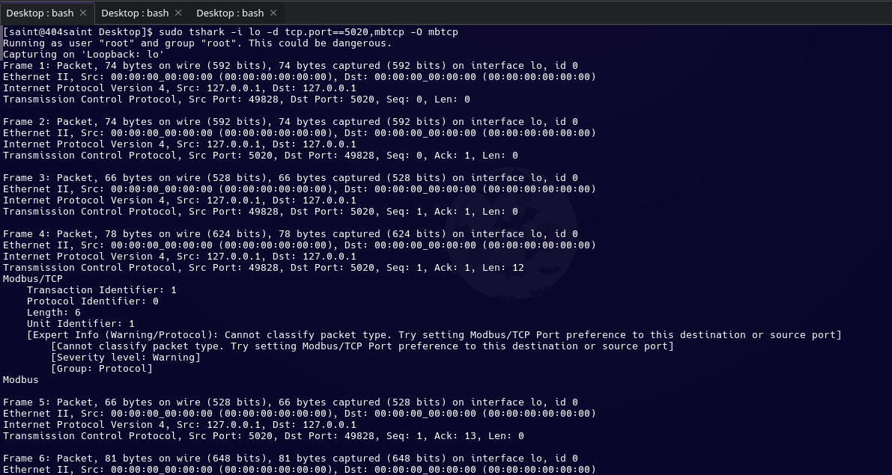
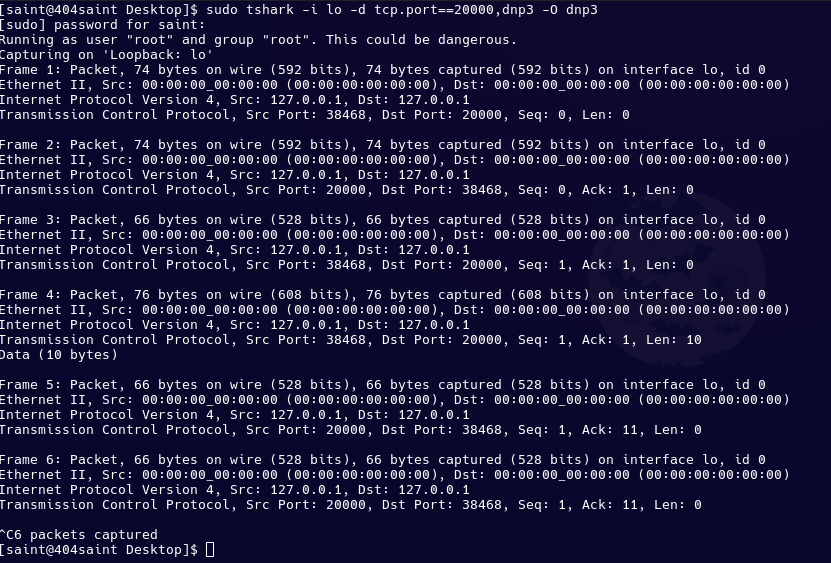
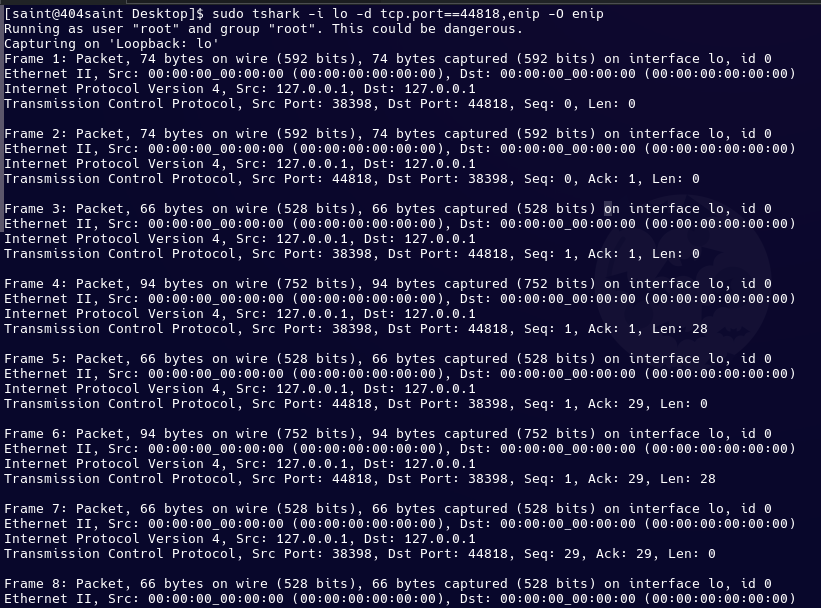
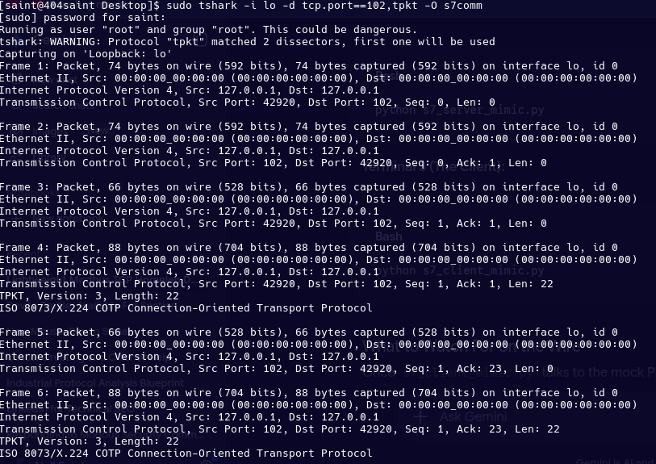
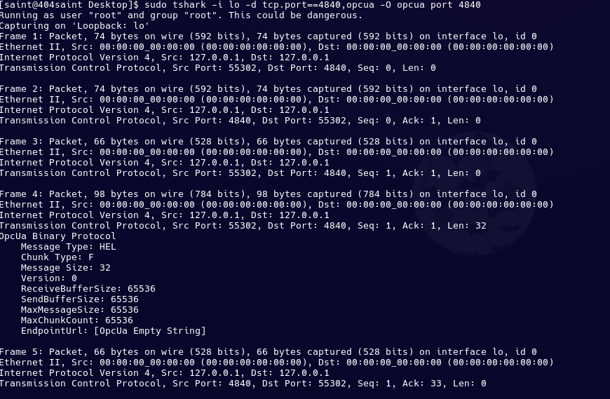

# Low-Level Industrial Protocol Analysis & Lab Handshakes

This document serves as the master engineering reference for the foundational handshakes executed across five defining protocol suites of Industrial Control Systems (ICS) and Operational Technology (OT).

---

## 1. Master Protocol Layering Matrix

| Protocol | Default Port | Transport Layer | Intermediate Wrapper / Framing | Core Security Baseline |
| --- | --- | --- | --- | --- |
| **Modbus/TCP** | `502` | TCP | MBAP Header (7 Bytes) | Explicitly None (Cleartext) |
| **DNP3** | `20000` | TCP / UDP | Custom Link/Transport Layer (EPA) | Cleartext / Optional Secure Auth |
| **EtherNet/IP** | `44818` | TCP / UDP | Encapsulation Header (24 Bytes) | Cleartext Session Tracking |
| **S7Comm** | `102` | TCP | TPKT (RFC 1006) $\rightarrow$ COTP (ISO 8073) | Cleartext by Design |
| **OPC UA** | `4840` | TCP | Native Binary Transport Layer | Configurable (None / Sign / Encrypt) |

---

## 2. Modbus/TCP: The Legacy Workhorse

### The Field Reality

Modbus/TCP is the grandfather of industrial automation communications. Developed in the late 1970s for serial links and later adapted to Ethernet, it completely lacks authentication, encryption, or cryptographic integrity checking. If an engineering workstation can route a packet to a Modbus PLC, it can manipulate it.

To adapt to IP-based networks, the protocol strips away the old serial CRC checksum and adds a 7-byte **MBAP (Modbus Application Protocol)** header. This structural envelope sits directly on top of raw TCP streams to track transactions.

```text
+-------------------------------------------------------------------------+
|  Eth  |  IP  |  TCP  |       MBAP Header (7 Bytes)       |  Modbus PDU  |
|       |      |       |  TransID (2B) | ProtoID (2B) | ...|  FC  | Data  |
+-------------------------------------------------------------------------+

```

### Raw Handshake Byte Anatomy

<details>
<summary>📸 Click to view Live Terminal Capture (tshark verification)</summary>

### Modbus/TCP Live Wire Verification
> **Environment:** `saint@404saint` | Interface: `lo` | Filter: `port 502`



</details>

A standard application frame reading 10 holding registers starting at memory offset 0 manifests as a 12-byte payload:

```text
00 01 00 00 00 06 01 03 00 00 00 0A

```

* **`00 01` (Transaction ID):** Sequential counter generated by the client to pair asynchronous requests and responses.
* **`00 00` (Protocol ID):** Fixed zero-value tracking sequence dedicated strictly to Modbus/TCP.
* **`00 06` (Length):** A 16-bit integer counting remaining bytes ($0x0006 = 6\text{ bytes}$ follow).
* **`01` (Unit ID):** Outstation drop routing index, primarily used to cross hardware translation gateways.
* **`03` (Function Code):** The explicit command directive `0x03` representing **Read Holding Registers**.
* **`00 00` (Starting Address):** The specific internal memory index register to begin targeting.
* **`00 0A` (Quantity):** The 16-bit payload requesting exactly 10 registers ($10 \times 16\text{-bit registers}$).

### Lab Replication Execution

To run this test locally using our decoupled lab directories, isolate the loopback interface on the default Modbus channel:

```bash
# Terminal 1: Initialize the background sniffer
sudo tshark -i lo -d tcp.port==502,modbus -O modbus port 502

# Terminal 2: Spin up the target emulator
python scripts/modbus_server.py

# Terminal 3: Execute the transaction injection
python scripts/modbus_client.py

```

---

## 3. DNP3: The Utility Anchor

### The Field Reality

The Distributed Network Protocol (DNP3) is the backbone of critical infrastructure power generation and water distribution systems. Because it was engineered to maintain transmission over highly unstable serial telemetry lines or radio links, it implements a complex, custom **EPA (Enhanced Performance Architecture)** stack. This framework layers a pseudo-Transport and explicit Data Link layer directly over standard TCP/UDP packets.

Every single DNP3 packet begins with a rigid 10-byte Link Layer header containing internal CRC blocks to prevent packet corruption. While modern updates introduce DNP3 Secure Authentication (SAv5), classic field implementations route all telemetry, setpoints, and binary commands in unauthenticated cleartext.

### Raw Handshake Byte Anatomy

<details>
<summary>📸 Click to view Live Terminal Capture (tshark verification)</summary>

### DNP3 Distributed Network Protocol Wire Verification
> **Environment:** `saint@404saint` | Interface: `lo` | Filter: `port 20000`



</details>

A Link Status checking frame initiated by a master processing node presents the following 10-byte structure on the wire:

```text
05 64 05 C9 00 00 01 00 4D 50

```

* **`05 64` (Start Bytes):** Fixed magic header tracking sequence signaling the absolute boundary entry point.
* **`05` (Length):** Flags the remaining byte sequence volume minus the frame check blocks ($0x05 = 5\text{ bytes}$).
* **`C9` (Control Byte):** Bitmask defining frame intent; `0xC9` commands a primary master link check request.
* **`00 00` (Destination Address):** 16-bit Little-Endian index tracking the remote physical outstation/RTU.
* **`01 00` (Source Address):** 16-bit Little-Endian index assigning ownership to the master processing station.
* **`4D 50` (Data Link CRC):** The 16-bit algebraic checksum explicitly validating the integrity of the header layout.

### Lab Replication Execution

Execute the isolated tracking process targeting the standard DNP3 control channel:

```bash
# Terminal 1: Launch the structured SCADA sniffer
sudo tshark -i lo -d tcp.port==20000,dnp3 -O dnp3 port 20000

# Terminal 2: Initialize the outstation mimic
python scripts/dnp3_master_mimic.py

```

---

## 4. EtherNet/IP & CIP: The Enterprise Factory Protocol

### The Field Reality

EtherNet/IP is Rockstar Automation's adaptation of the **Common Industrial Protocol (CIP)** for standard IP networks. It splits industrial traffic into explicit messages (configuration, polling, programming via TCP) and implicit messages (high-speed, cyclic I/O production data via UDP).

To manage session contexts before any actual control operations take place, the protocol wraps its payload in a 24-byte **Encapsulation Header**. While CIP Security can encrypt these links using TLS/DTLS, default network deployments handle session tracking numbers and target registry definitions in cleartext. This exposure allows an on-path attacker to intercept session handles and hijack communication.

### Raw Handshake Byte Anatomy

<details>
<summary>📸 Click to view Live Terminal Capture (tshark verification)</summary>

### EtherNet/IP Encapsulation Session Verification
> **Environment:** `saint@404saint` | Interface: `lo` | Filter: `port 44818`



</details>

Before querying diagnostic endpoints, an engineering client must map a baseline handle via a **Register Session** exchange. The 28-byte sequence:

```text
65 00 04 00 00 00 00 00 00 00 00 00 41 41 41 41 41 41 41 41 00 00 00 00 01 00 00 00

```

* **`65 00` (Command):** Explicit mapping for the `Register Session` operation primitive.
* **`04 00` (Length):** Little-Endian metric verifying a trailing payload footprint of exactly 4 bytes.
* **`00 00 00 00` (Session Handle):** Initialized to empty by the client. The controller populates this tracking sequence in its response.
* **`00 00 00 00` (Status):** Flags execution health metrics; all zeros indicates an uncompromised state.
* **`41 41 41 41 41 41 41 41` (Sender Context):** Fixed 8-byte diagnostic tracking array that the receiving controller must mirror back exactly.
* **`00 00 00 00` (Options Flags):** Fixed parameters reserved for custom routing metrics.
* **`01 00 00 00` (Command Data):** Configures protocol setup options (Version 1).

### Lab Replication Execution

Run the tracking sequence against the standard control execution interface:

```bash
# Terminal 1: Spin up the tracking engine
sudo tshark -i lo -d tcp.port==44818,enip -O enip port 44818

# Terminal 2: Run the controller emulation layer
python scripts/eip_server_mimic.py

# Terminal 3: Fire the tracking session request
python scripts/eip_session_mimic.py

```

---

## 5. S7Comm: The Proprietary Controller Core

### The Field Reality

S7Comm is the proprietary protocol powering Siemens S7-300 and S7-400 programmatic execution lines. Rather than communicating directly over a raw TCP socket, S7Comm wraps itself inside a nested ISO transport layout to enforce programmatic safety boundaries:

1. **TPKT (RFC 1006):** Acts as a packetizer, prepending a 4-byte header to stream-oriented TCP sockets to mimic a continuous ISO transport circuit.
2. **COTP (ISO 8073):** Manages explicit OSI Layer 4 capabilities inside the TPKT block, using specific Protocol Data Units (PDUs) to negotiate connections before S7 frames are processed.

Because standard S7Comm relies heavily on security through obscurity, all functional directives, memory addresses, and data reads are passed in cleartext.

### Raw Handshake Byte Anatomy
<details>
<summary>📸 Click to view Live Terminal Capture (tshark verification)</summary>

### Siemens S7Comm TPKT/COTP Transport Verification
> **Environment:** `saint@404saint` | Interface: `lo` | Filter: `port 102`



</details>

The initial baseline access step requests an implicit **COTP Connection Request (CR)**. The exact 22-byte string:

```text
03 00 00 16 11 E0 00 00 00 01 00 C0 01 0A C1 02 01 00 C2 02 02 00

```

* **`03 00 00 16` (TPKT Header):** Preloads Version 3 and maps a total upcoming envelope volume of 22 bytes ($0x0016 = 22$).
* **`11` (COTP Length Indicator):** Identifies that exactly 17 parameter description bytes follow.
* **`E0` (PDU Type):** Identifies the frame as an explicit **Connection Request (CR)**.
* **`00 00` / `00 01` (References):** Assigned destination tracking handles and client-side tracking indicators.
* **`C0 01 0A` (TPDU Size Parameter):** Negotiates maximum raw packet transmission sizes ($2^{10} = 1024\text{ bytes}$).
* **`C1 02 01 00` (Source TSAP):** Identifies the client process initiating the tracking step.
* **`C2 02 02 00` (Destination TSAP):** The crucial hardware tracking address mapping the target PLC rack and slot placement directly.

### Lab Replication Execution

Because S7Comm targets a privileged low-range infrastructure port, the receiver mapping sequence requires running with administrative privileges:

```bash
# Terminal 1: Launch the nested transport sniffer
sudo tshark -i lo -d tcp.port==102,tpkt -O s7comm port 102

# Terminal 2: Initialize the hardware mimic (Requires administrative privilege)
sudo python scripts/s7_server_mimic.py

# Terminal 3: Dispatch the connection request sequence
python scripts/s7_client_mimic.py

```

---

## 6. OPC UA: The Modern IT/OT Cryptographic Bridge

### The Field Reality

OPC UA completely discards legacy serial layouts, register boundaries, and old Windows-bound DCOM dependencies. Instead, it provides a cross-platform, object-oriented information model designed to bring modern IT security concepts directly into the OT space:

* **X.509 Certificate Exchanges:** Devices must explicitly trust each other's cryptographic certificates before communicating.
* **Security Policies:** Native support for signing and encryption (e.g., `Basic256Sha256`).
* **The Plaintext Backdoor:** During commissioning, maintenance, or in older setups, engineers often set the security policy to `None`. When this happens, the entire object-oriented data stream is passed completely in cleartext, allowing session tokens and node structures to be easily captured on the wire.

### The Plaintext Handshake Architecture

Before an encrypted session begins (or when running on a policy of `None`), an OPC UA client and server execute a raw binary socket exchange over TCP port 4840:

```text
HEL (Hello) -> Client proposes buffer sizes and parameters.
ACK (Acknowledge) -> Server accepts or adjusts the connection limits.
OPN (OpenSecureChannel) -> Structural token and certificate mapping phase.

```

### Raw Handshake Byte Anatomy

<details>
<summary>📸 Click to view Live Terminal Capture (tshark verification)</summary>

### OPC UA Pristine Native Dissection Tree
> **Environment:** `saint@404saint` | Interface: `lo` | Filter: `port 4840`



</details>

The standardized 32-byte layout initializing the **Hello (`HEL`)** sequence:

```text
48 45 4C 46 20 00 00 00 00 00 00 00 00 00 01 00 00 00 01 00 00 00 01 00 00 00 01 00 00 00 00 00

```

* **`48 45 4C` (Message Type):** ASCII text markers parsing explicitly to the token `HEL`.
* **`46` (Chunk Type):** ASCII character `F` (Final chunk), signaling a self-contained transmission window.
* **`20 00 00 00` (Message Size):** Little-Endian unsigned integer confirming a packet size of 32 bytes ($0x20 = 32$).
* **`00 00 00 00` (Protocol Version):** Establishes the core binary specification target revision layer (Version 0).
* **`00 00 01 00` (Receive Buffer Size):** Sets maximum acceptable inbound layer tracking dimensions ($0x00010000 = 65,536\text{ bytes}$).
* **`00 00 01 00` (Send Buffer Size):** Sets maximum outbound chunk transmission metrics ($65,536\text{ bytes}$).
* **`00 00 01 00` (Max Message Size):** Imposes upper limits on aggregated logical messages.
* **`00 00 01 00` (Max Chunk Count):** Restricts maximum concurrent streaming chunk iterations.
* **`00 00` (Endpoint URL Padding):** Signifies an empty URL string length descriptor for local capture testing.

### Lab Replication Execution

Execute the isolated testing trace targeting the standard OPC UA endpoint:

```bash
# Terminal 1: Initialize the native binary dissector
sudo tshark -i lo -d tcp.port==4840,opcua -O opcua port 4840

# Terminal 2: Initialize the secure endpoint mimic
python scripts/opcua_server_mimic.py

# Terminal 3: Fire the unencrypted tracking handshake
python scripts/opcua_client_mimic.py

```

---

## 7. Deep-Dive Lab Engineering Insights

### The Alignment Check Mismatch (The Unparsed Tree Condition)

During the creation of the low-level byte injection tools, a common friction point occurs where `tshark` captures raw frames but refuses to generate the `OpcUa Binary Protocol` decode tree. This issue occurs when the network analysis engine detects an **Alignment Mismatch**.

If a script declares an internal size block of 32 bytes (`\x20\x00\x00\x00`) but physically only transmits 28 bytes on the wire, the engine assumes the packet is corrupt or malformed. To safeguard data parsing integrity, it drops the detailed protocol view and falls back to a raw `TCP Data` label. Ensuring the physical byte count matches the internal headers down to the final padding byte instantly unblocks native tree dissection:

```text
OpcUa Binary Protocol
    Message Type: HEL
    Chunk Type: F
    Message Size: 32

```
